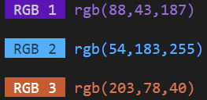
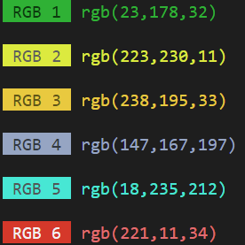

<body>
# rgb-random
A simple npm proyect, that gives you a series of random colors in  <span style="background-color:#fcfcfc;"><font color="red" bgcolor="#def28d">⠀R </font><font color="green"> G </font><font color="blue"> B⠀</font></span> format.
<br><br>

# Install
```
npm i rgb-random
```

# Usage
In your <font color="skyBlue">*Command Line Interface*</font> aka __CLI__

Type:  `npm start` **`'Number'`**


Where **`Number`** is a **<font color="green">Number</font>** from **<font color="green">1</font>** to **<font color="green">6</font>**, and press Enter

<br>
Example:

> `npm start 3`

Result:

<h1 align="start">
	
	<br>
</h1>

## Or
```
npx rgb-random 'Number'
```
### Then you will be asked to:
> Need to install the following packages:

> rgb-random@1.X.X

> Ok to proceed? (y)

`Press 'y' and hit Enter`

<br>
Example:

> `npx rgb-random 6`

Result:
<h1 align="start">
	
	<br>
</h1>

<br>
</body>